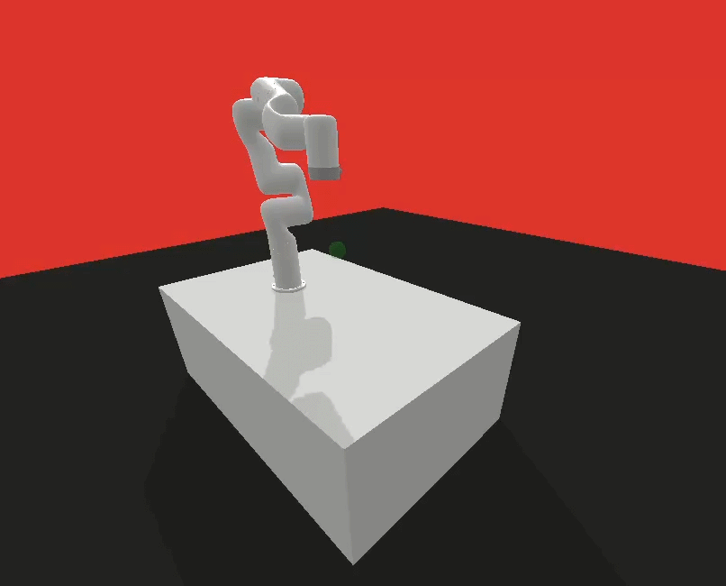
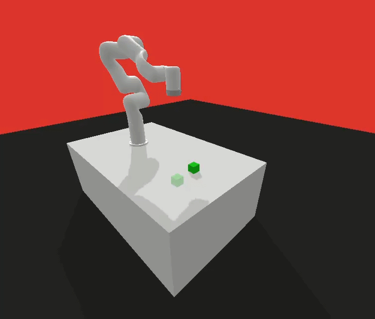
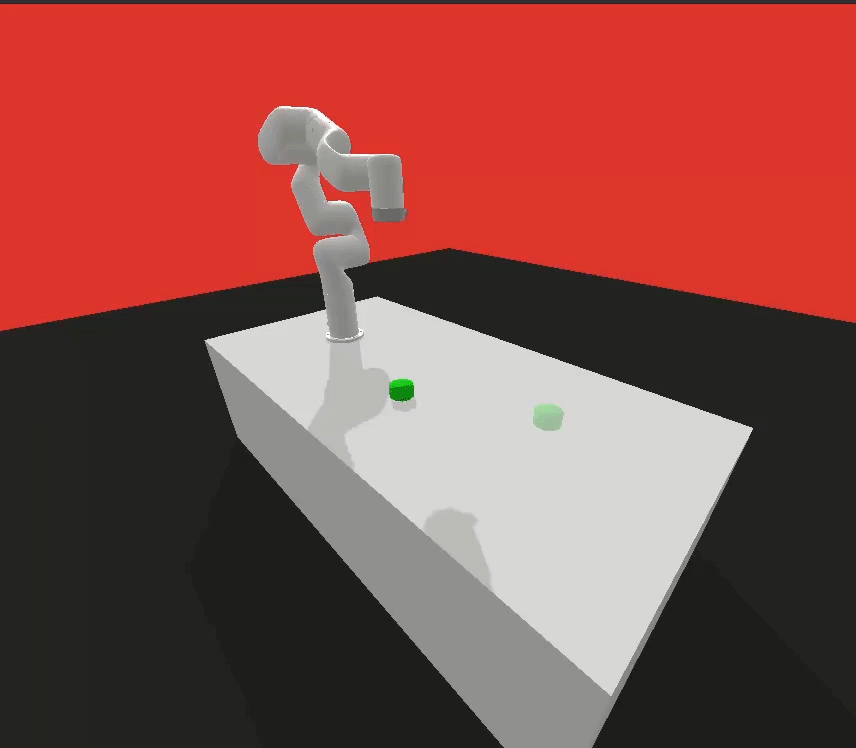
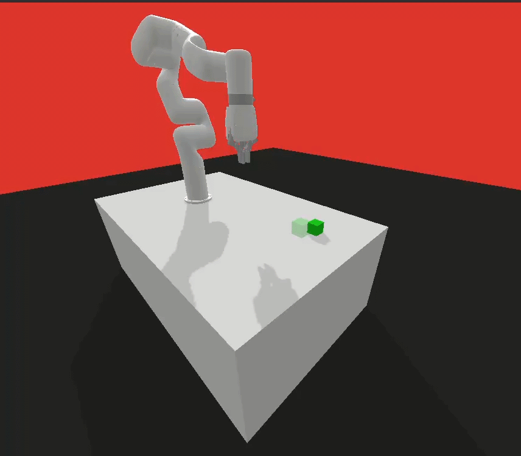

# uf-gym

Adding UFACTORY robot model support to [panda-gym](https://github.com/qgallouedec/panda-gym/tree/master) training and simulation tools for Reinforcement Learning (RL). This repository is developed based on the original `panda-gym` framework and should work alongside with it.

Please check the `panda-gym` page for detailed documentation and credit information.

## Prerequisites
1. Python 3.8+ and [pytorch](https://pytorch.org/get-started/locally/);
2. Nvidia driver and CUDA with proper versions for your GPU device.
3. [stable baselines 3](https://stable-baselines3.readthedocs.io/en/master/guide/install.html) and extended module [sb3-contrib](https://stable-baselines3.readthedocs.io/en/master/guide/sb3_contrib.html#installation).
4. [pybullet](https://pypi.org/project/pybullet/)
5. [panda-gym](https://github.com/qgallouedec/panda-gym/tree/master?tab=readme-ov-file#installation)
6. Other dependent packages needed during installation or running process.

## Usage

1. The scripts have self-explanatory names, to train xArm7 with pick and place task:
```
$ python train_xarm7_pickNplace.py
```
2. To test the trained model for pick and place task:
```
$ python test_xarm7_pickNplace.py
```
The algorithm, hyper-parameters, task, model name, saving directories etc. can all be modified in the code according to your needs. 

Currently only xArm6 and xArm7 (with gripper) are supported, other models will be added in the future.

## Training Results Demo

|                                  |                                                |
| :------------------------------: | :--------------------------------------------: |
|         `XArm6Reach-v3`          |                 `XArm6Push-v3`                 |
|  |           |
|         `XArm7Slide-v3`          |             `XArm7PickAndPlace-v3`             |
|  |  |


## Pre-trained models

Pre-trained models will be uploaded to [Hugging Face](https://huggingface.co) platform later.
